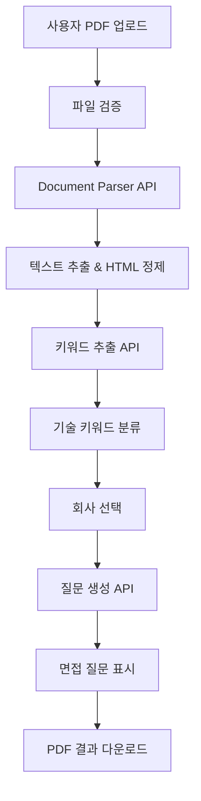
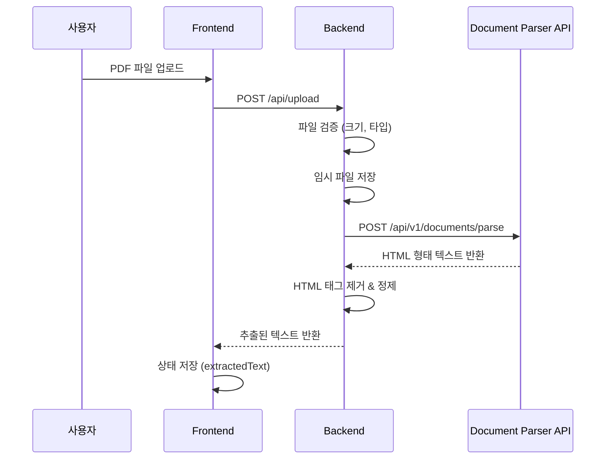
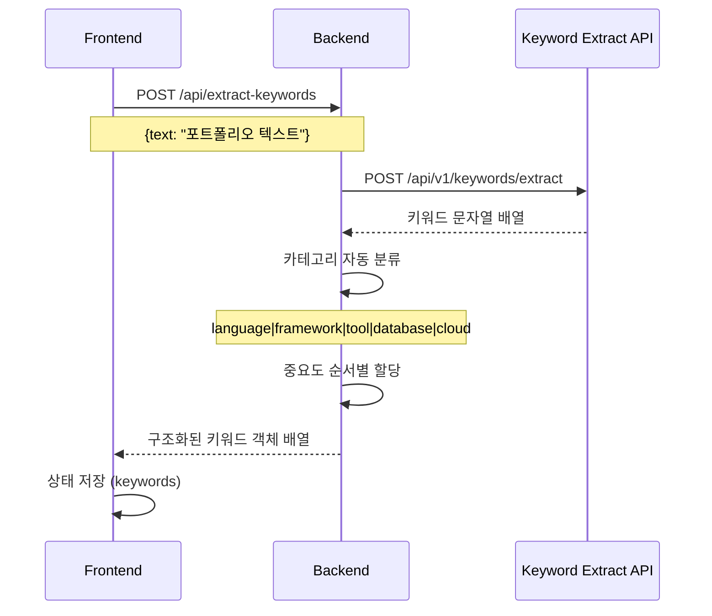
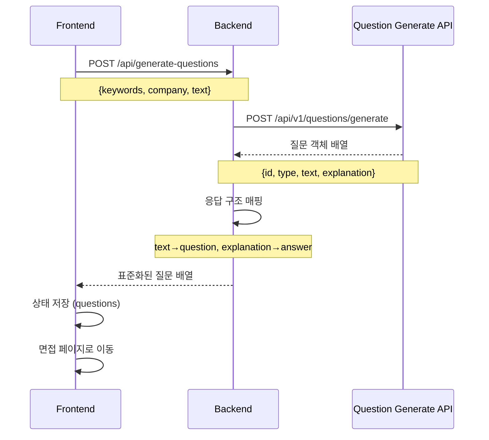
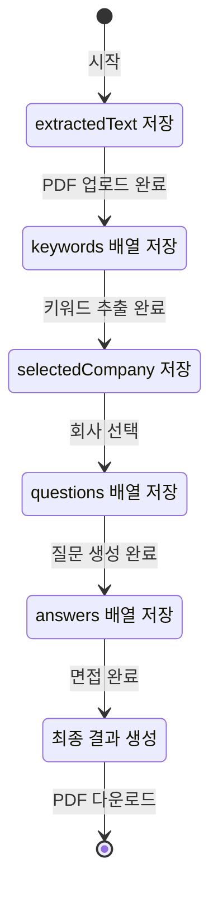
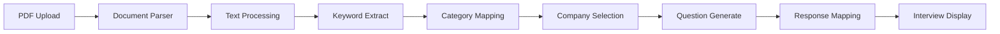
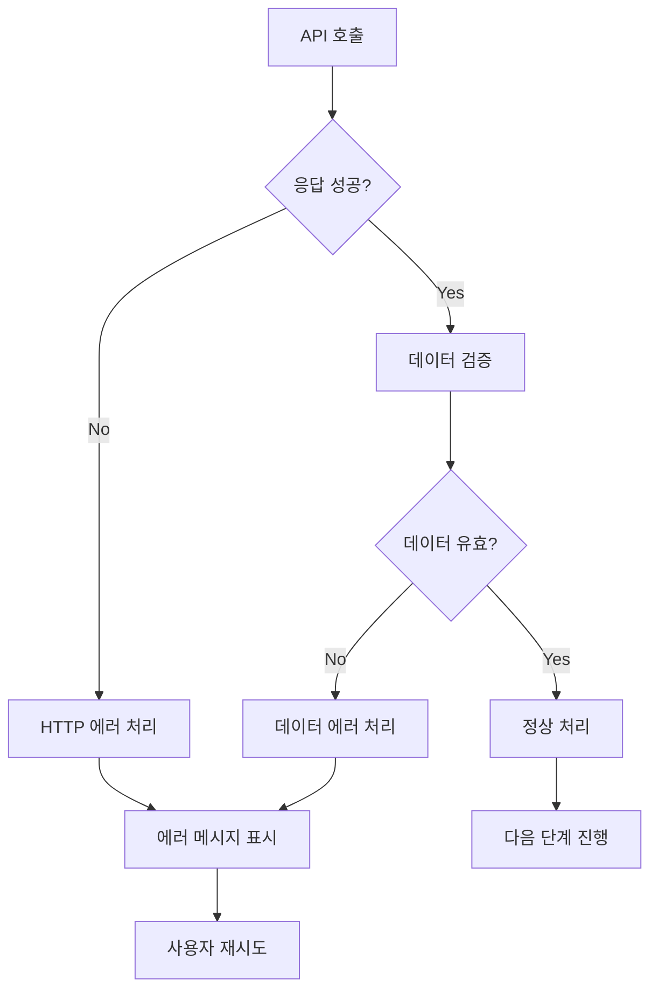
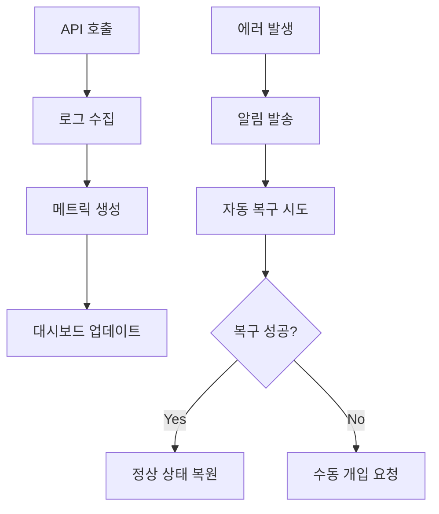
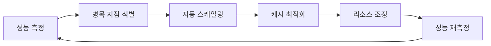

# Forky 자동화 워크플로우

## 전체 시스템 플로우



## 상세 워크플로우

### 1. 파일 업로드 & 처리 워크플로우



### 2. 키워드 추출 워크플로우



### 3. 질문 생성 워크플로우



## 데이터 플로우

### 상태 관리 플로우



### API 호출 체인



## 에러 처리 워크플로우



## 자동화 스크립트 예시

### CI/CD 파이프라인

```yaml
# .github/workflows/deploy.yml
name: Deploy Forky
on:
  push:
    branches: [main]

jobs:
  test:
    runs-on: ubuntu-latest
    steps:
      - uses: actions/checkout@v3
      - name: Test Backend
        run: |
          cd backend
          pip install -r requirements.txt
          python -m pytest
      - name: Test Frontend
        run: |
          cd frontend
          npm install
          npm test

  deploy:
    needs: test
    runs-on: ubuntu-latest
    steps:
      - name: Deploy to AWS
        run: |
          # AWS 배포 스크립트
          docker build -t forky .
          docker push $ECR_REGISTRY/forky:latest
```

### 개발 환경 자동 설정

```bash
#!/bin/bash
# setup.sh - 개발 환경 자동 설정

echo "🚀 Forky 개발 환경 설정 시작..."

# 백엔드 설정
cd backend
python -m venv venv
source venv/bin/activate
pip install -r requirements.txt

# 프론트엔드 설정
cd ../frontend
npm install

# 환경 변수 설정
cp backend/.env.example backend/.env
echo "✅ 개발 환경 설정 완료!"
```

## 모니터링 워크플로우



## 성능 최적화 자동화



이 워크플로우를 통해 Forky 시스템의 전체적인 자동화 프로세스를 이해하고 관리할 수 있습니다.