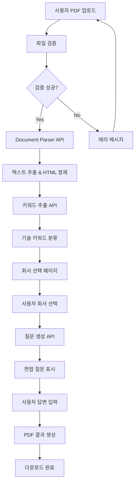
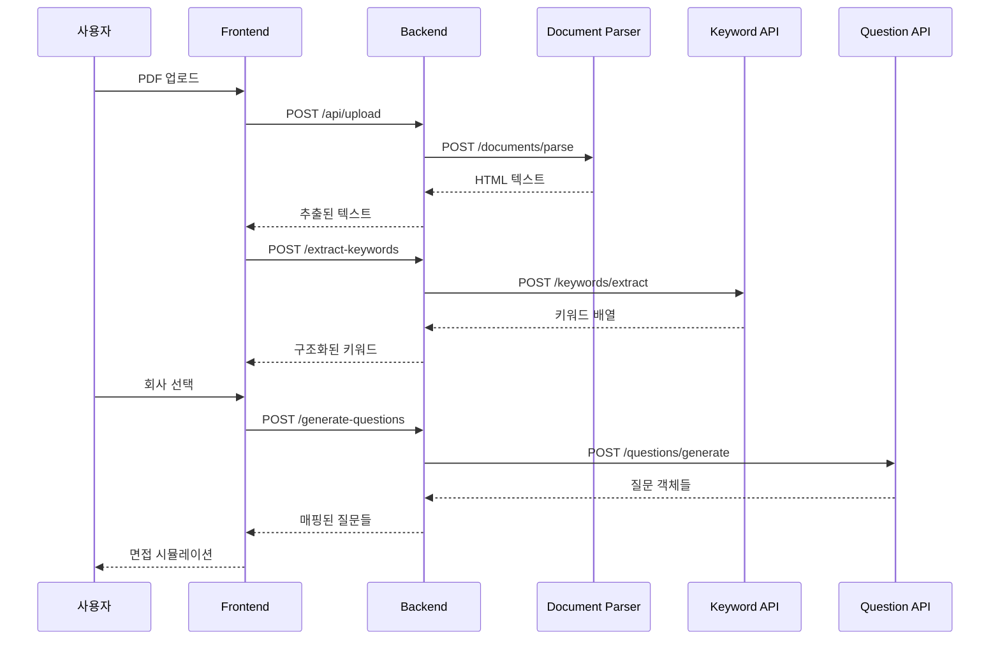
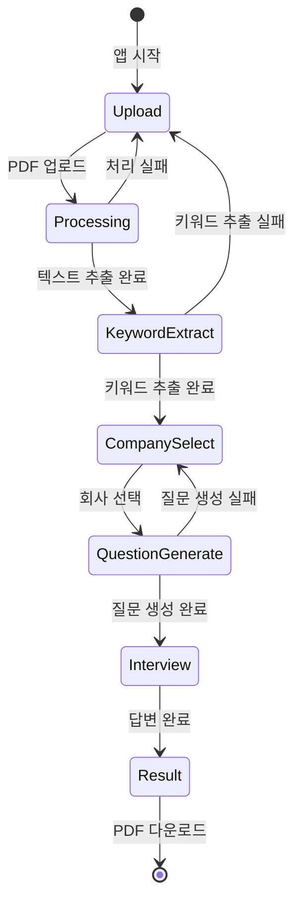
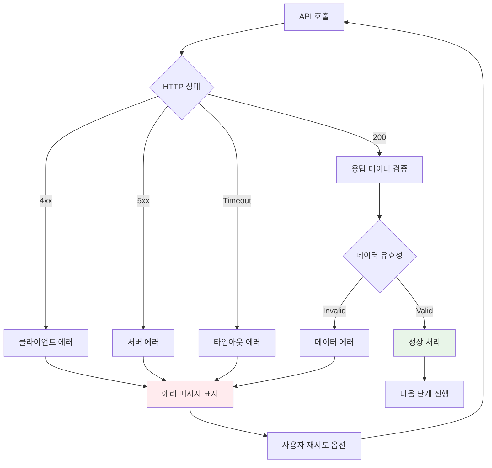
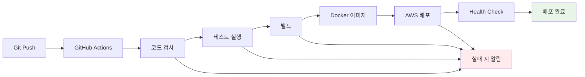
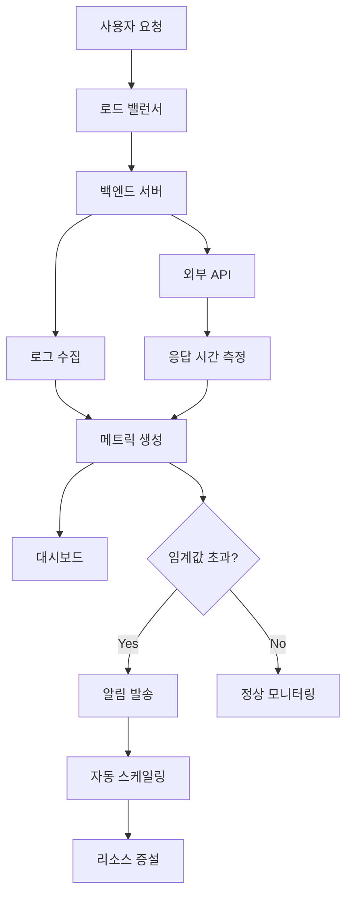

# Forky 워크플로우 Mermaid 다이어그램

## 1. 전체 시스템 플로우



## 2. API 호출 시퀀스 다이어그램



## 3. 상태 관리 플로우



## 4. 데이터 플로우 다이어그램

```mermaid
flowchart LR
    A[PDF 파일] --> B[파일 검증]
    B --> C[Document Parser]
    C --> D[HTML 텍스트]
    D --> E[텍스트 정제]
    E --> F[키워드 추출]
    F --> G[카테고리 분류]
    G --> H[중요도 할당]
    H --> I[회사 선택]
    I --> J[질문 생성]
    J --> K[응답 매핑]
    K --> L[면접 질문]
    
    style A fill:#e1f5fe
    style L fill:#e8f5e8
    style C fill:#fff3e0
    style F fill:#fff3e0
    style J fill:#fff3e0
```



## 5. MVC 아키텍처 다이어그램

```mermaid
graph TB
    subgraph "Frontend (View)"
        V1[UploadPage]
        V2[CompanyPage]
        V3[InterviewPage]
        V4[ResultPage]
        V5[Components]
    end
    
    subgraph "Backend (Controller)"
        C1[/api/upload]
        C2[/api/extract-keywords]
        C3[/api/generate-questions]
        C4[/api/companies]
    end
    
    subgraph "Services & Models"
        S1[DocumentParserService]
        S2[AIService]
        S3[FileService]
        M1[Keyword Model]
        M2[Question Model]
        M3[Company Model]
    end
    
    subgraph "External APIs"
        E1[Document Parser API]
        E2[Keyword Extract API]
        E3[Question Generate API]
    end
    
    V1 --> C1
    V2 --> C2
    V2 --> C4
    V3 --> C3
    
    C1 --> S1
    C2 --> S2
    C3 --> S2
    C4 --> M3
    
    S1 --> E1
    S2 --> E2
    S2 --> E3
    
    S1 --> M1
    S2 --> M2
```

## 6. 에러 처리 플로우



## 7. CI/CD 파이프라인

```mermaid
gitgraph
    commit id: "Initial"
    branch develop
    checkout develop
    commit id: "Feature A"
    commit id: "Feature B"
    checkout main
    merge develop
    commit id: "Release v1.0"
    
    branch hotfix
    checkout hotfix
    commit id: "Bug Fix"
    checkout main
    merge hotfix
    commit id: "Release v1.0.1"
```



## 8. 성능 모니터링 플로우



## 사용법

1. **Mermaid Live Editor**: https://mermaid.live/
2. **GitHub**: 마크다운 파일에 직접 삽입
3. **VS Code**: Mermaid 확장 프로그램 설치
4. **Notion, Obsidian**: Mermaid 지원 도구 사용

각 다이어그램 코드를 복사해서 위 도구들에 붙여넣으면 시각적인 다이어그램으로 렌더링됩니다.