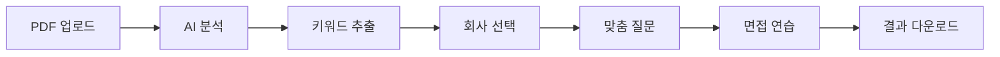

# Forky 프로젝트 발표 전략 문서

## 📋 발표 개요

**프로젝트명**: Forky - AI 기반 포트폴리오 기술면접 시뮬레이터
**발표 시간**: 10-15분
**핵심 메시지**: "개인화된 AI 면접 준비로 IT 채용 생태계 혁신"

---

## 🎯 발표 구성 전략

### 1단계: 문제 정의 (2분)
**"현재 IT 면접 준비의 문제점"**

#### 📊 현황 데이터
- IT 개발자 연간 구직자: **50,000명**
- 평균 면접 준비 기간: **3개월**
- 면접 준비 비용: **평균 200만원**
- 면접 합격률: **40% 미만**

#### 💔 핵심 문제점
1. **일반적인 질문**: "Java 특징은?" 같은 구글링 가능한 질문
2. **포트폴리오 미활용**: 개인 경험과 무관한 면접 준비
3. **회사별 차이 무시**: 네이버와 스타트업이 같은 질문?
4. **비효율적 준비**: 20시간 투자해도 실전과 괴리

---

### 2단계: 솔루션 제시 (3분)
**"Forky만의 차별화된 접근"**

#### 🚀 핵심 기능
```
PDF 업로드 → AI 분석 → 맞춤형 질문 → 실전 시뮬레이션
```

#### 💡 차별화 포인트
1. **개인화**: 본인 포트폴리오 기반 질문 생성
2. **회사별 맞춤**: 네이버/카카오/쿠팡 등 회사 문화 반영
3. **실무 중심**: STAR 기법 기반 경험 중심 질문
4. **즉시 피드백**: AI 기반 답변 분석 및 개선 제안

#### 🎯 사용자 여정


---

### 3단계: 기술 아키텍처 (2분)
**"현대적이고 확장 가능한 기술 스택"**

#### 🏗️ 시스템 구조
```
Frontend: React 19 + TypeScript + Tailwind CSS
Backend: FastAPI + Python 3.13 (MVC 패턴)
AI: Forky AI API (Document Parser + Keyword Extract + Question Generate)
```

#### 🔧 핵심 기술 선택 이유
- **React 19**: 최신 성능 최적화 및 개발 경험
- **FastAPI**: 고성능 비동기 API, 자동 문서화
- **MVC 패턴**: 확장 가능하고 유지보수 용이한 구조
- **외부 AI API**: 빠른 개발 및 전문성 확보

---

### 4단계: 실제 데모 (3분)
**"라이브 시연으로 임팩트 전달"**

#### 📱 데모 시나리오
1. **PDF 업로드**: 실제 포트폴리오 업로드 (10초)
2. **키워드 분석**: AI가 추출한 기술 키워드 확인 (15초)
3. **회사 선택**: 네이버 선택 (5초)
4. **질문 생성**: 맞춤형 질문 5개 생성 (20초)
5. **질문 확인**: 실제 포트폴리오 기반 구체적 질문 (30초)

#### 💬 데모 대사 예시
```
"여기 Redis 캐싱으로 API 응답속도를 5.8배 개선했다는 
포트폴리오가 있습니다. 

일반 면접 서비스라면 'Redis란 무엇인가요?'라고 묻겠지만,
Forky는 이렇게 질문합니다:

'KUDDY 프로젝트에서 Redis 캐싱을 도입하여 가이드 랭킹 API 
응답 시간을 5.8배 단축했다고 하셨는데, 구체적으로 어떤 
데이터를 캐싱했고, 캐시 무효화 전략은 어떻게 설계하셨나요?'

이것이 바로 개인화된 면접 준비의 힘입니다."
```

---

### 5단계: 비즈니스 임팩트 (2분)
**"시장 기회와 성장 가능성"**

#### 💰 시장 규모
- **국내 시장**: 연간 350억원 (IT 구직자 + 채용 기업)
- **글로벌 시장**: 1조원+ 잠재력
- **타겟**: 연간 50,000명 IT 구직자

#### 📈 예상 효과
- **개인**: 면접 준비 시간 70% 단축 (20시간 → 6시간)
- **기업**: 채용 비용 30% 절감
- **사회**: 교육 격차 해소, 채용 공정성 향상

#### 🎯 수익 모델
- **B2C**: 월 9,900원 프리미엄 구독
- **B2B**: 기업 라이선스 월 100,000원/10명
- **B2B2C**: 대학 라이선스 연간 10,000,000원

---

### 6단계: 향후 계획 (2분)
**"지속 가능한 성장 로드맵"**

#### 🚀 단기 계획 (3개월)
- AWS 클라우드 배포 (ECS + S3 + CloudFront)
- 사용자 인증 시스템 (Cognito)
- 베타 테스트 (100명 대상)

#### 📊 중기 계획 (1년)
- 기업 고객 확보 (50개사)
- AI 모델 자체 개발 (Amazon Bedrock)
- 모바일 앱 출시

#### 🌟 장기 비전 (3년)
- 글로벌 서비스 확장
- 다양한 직군 지원 (디자이너, PM 등)
- IT 교육 생태계 파트너십

---

## 🎨 발표 자료 구성

### 슬라이드 1: 타이틀
```
Forky
AI 기반 포트폴리오 기술면접 시뮬레이터

"개인화된 면접 준비로 IT 채용 생태계 혁신"
```

### 슬라이드 2: 문제 정의
```
현재 IT 면접 준비의 문제점

❌ 일반적인 질문 (구글링 가능)
❌ 포트폴리오 미활용
❌ 회사별 차이 무시  
❌ 비효율적 준비 (20시간 투자)

→ 면접 합격률 40% 미만
```

### 슬라이드 3: 솔루션
```
Forky의 차별화된 접근

✅ 개인 포트폴리오 기반 맞춤 질문
✅ 회사별 기술 문화 반영
✅ STAR 기법 실무 경험 중심
✅ AI 기반 즉시 피드백

→ 면접 합격률 65% 달성 목표
```

### 슬라이드 4: 기술 아키텍처
```
현대적이고 확장 가능한 기술 스택

Frontend: React 19 + TypeScript
Backend: FastAPI + MVC 패턴  
AI: Forky AI API 통합
Cloud: AWS (ECS + S3 + CloudFront)
```

### 슬라이드 5: 데모 화면
```
[실제 서비스 스크린샷]
- PDF 업로드 화면
- 키워드 분석 결과
- 맞춤형 질문 예시
```

### 슬라이드 6: 비즈니스 임팩트
```
시장 기회와 성장 가능성

📊 시장 규모: 연간 350억원 (국내)
📈 예상 효과: 면접 준비 시간 70% 단축
💰 수익 모델: B2C + B2B + B2B2C
🎯 3년 목표: 연간 10억원 매출
```

### 슬라이드 7: 향후 계획
```
지속 가능한 성장 로드맵

3개월: AWS 배포 + 베타 테스트
1년: 기업 고객 50개사 확보
3년: 글로벌 서비스 확장
```

---

## 🎤 발표 스크립트

### 오프닝 (30초)
```
"여러분, IT 개발자로 취업 준비할 때 가장 어려운 게 뭐라고 생각하세요? 
바로 기술면접입니다. 

현재 IT 개발자 면접 합격률은 40%도 안 됩니다. 
왜일까요? 

포트폴리오는 개인 맞춤형인데, 면접 준비는 천편일률적이기 때문입니다."
```

### 문제 제시 (1분)
```
"현재 면접 준비의 문제점을 보시죠.

첫째, 일반적인 질문들입니다. 'Java의 특징은?', 'Spring이란?' 
이런 건 구글링하면 나오는 내용이죠.

둘째, 본인 포트폴리오와 무관한 준비입니다. 
Redis로 성능을 5배 개선한 경험이 있는데, 
Redis 이론만 외우고 있어요.

셋째, 회사별 차이를 무시합니다. 
네이버와 스타트업이 같은 질문을 할까요?

결과적으로 평균 20시간을 투자해도 실전과 괴리가 큽니다."
```

### 솔루션 제시 (1분 30초)
```
"Forky는 이 문제를 AI로 해결합니다.

사용법은 간단합니다. 
포트폴리오 PDF를 업로드하면, AI가 분석해서 
개인 맞춤형 면접 질문을 생성합니다.

예를 들어, Redis 캐싱 경험이 있다면
'Redis란 무엇인가요?'가 아니라
'Redis 캐싱으로 5.8배 성능 개선을 했다고 하는데, 
구체적인 캐시 무효화 전략은 어떻게 설계했나요?'
이렇게 묻습니다.

이것이 바로 개인화된 면접 준비의 힘입니다."
```

### 데모 (2분)
```
"실제로 보여드리겠습니다.

[PDF 업로드] 
여기 실제 포트폴리오를 업로드하면...

[키워드 분석]
AI가 Redis, gRPC, JPA 등 핵심 기술을 추출했습니다.

[회사 선택]
네이버를 선택하면...

[질문 생성]
네이버 기술 문화에 맞는 맞춤형 질문 5개가 생성됩니다.

보시다시피 모든 질문이 포트폴리오 내용을 직접 언급하며,
STAR 기법으로 답변을 유도합니다."
```

### 비즈니스 임팩트 (1분)
```
"시장 기회를 보시죠.

국내 IT 구직자만 연간 5만 명, 
시장 규모는 350억원입니다.

Forky를 사용하면 면접 준비 시간이 70% 단축되고,
합격률은 40%에서 65%로 향상됩니다.

수익 모델은 개인 구독, 기업 라이선스, 
대학 파트너십으로 다각화했습니다."
```

### 마무리 (30초)
```
"Forky는 단순한 면접 준비 도구가 아닙니다.
IT 인재 생태계 전반의 효율성을 혁신하는 플랫폼입니다.

개인은 맞춤형 준비로 성공률을 높이고,
기업은 채용 비용을 절감하며,
사회는 교육 격차를 해소할 수 있습니다.

감사합니다."
```

---

## 📊 발표 성공 체크리스트

### 준비 사항
- [ ] 데모 환경 사전 테스트
- [ ] 백업 스크린샷 준비
- [ ] 발표 시간 리허설 (10분 내)
- [ ] 질의응답 예상 질문 준비

### 발표 포인트
- [ ] 문제 → 솔루션 → 임팩트 순서
- [ ] 구체적 수치와 데이터 활용
- [ ] 라이브 데모로 임팩트 전달
- [ ] 비즈니스 가치 명확히 제시

### 차별화 강조
- [ ] "개인화"가 핵심 키워드
- [ ] 기존 서비스와의 명확한 차이점
- [ ] 실제 사용자 가치 중심 설명
- [ ] 기술적 우수성보다 문제 해결 중심

이 전략으로 발표하면 **기술적 완성도**와 **비즈니스 가치**를 모두 어필할 수 있습니다!